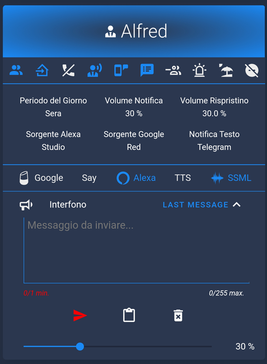
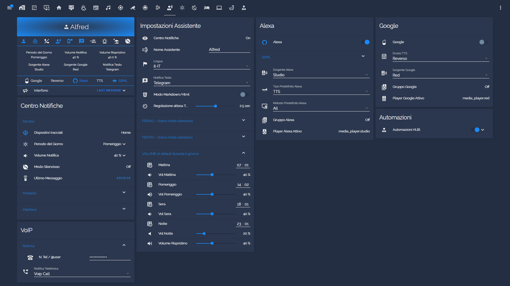
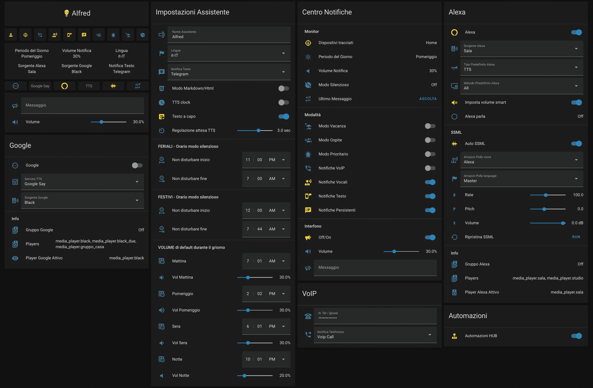

# Package Notification HUB AppDaemon

[![Hass.io][img-hassio]][link-hassio]

### Notifier Centre for Home Assistant by [Engineer Gianpi (@jumping2000)](https://github.com/jumping2000/appdaemon/commits?author=jumping2000) 

[![Hass.io][img-hassio]][link-hassio]

# Advice and useful information

- **[Wiki][Wiki]** 
- [AppDaemon: automazioni al massimo](https://hassiohelp.eu/2019/12/23/appdaemon-automazioni-al-massimo/) 
- [Nuovo Centro notifiche](https://hassiohelp.eu/2019/12/25/notifer/) 

# Requirements

  - [AppDaemon](https://appdaemon.readthedocs.io/en/latest/index.html) - [Addon](https://github.com/hassio-addons/repository)
  - [Sensor Workday](https://www.home-assistant.io/integrations/workday/)
  - [Sensor Time & Date](https://www.home-assistant.io/integrations/time_date/)

# [My Lovelace Card](./extra/my_lovelace_card.yaml)

> custom: 
  > - [Lovelace Card Mod](https://github.com/thomasloven/lovelace-card-mod)
  > - [Banner Card](https://github.com/nervetattoo/banner-card)
  > - [Lovelace Paper Buttons Row](https://github.com/jcwillox/lovelace-paper-buttons-row)
  > - [Lovelace Fold Entity Row](https://github.com/thomasloven/lovelace-fold-entity-row)
  > + [lovelace-multiline-text-input-card](https://github.com/faeibson/lovelace-multiline-text-input-card)
  > + [vertical-stack-in-card](https://github.com/ofekashery/vertical-stack-in-card)

  

# [My Lovelace view](./extra/my_lovelace_view.yaml)

  

# [Standard Lovelace View and Cards](./lovelace/)

  

[img-hassio]:https://img.shields.io/badge/config_for-Hass.io-53c1f1.svg?logo=data:image/svg+xml;base64,PD94bWwgdmVyc2lvbj0iMS4wIiBlbmNvZGluZz0iVVRGLTgiPz48IURPQ1RZUEUgc3ZnIFBVQkxJQyAiLS8vVzNDLy9EVEQgU1ZHIDEuMS8vRU4iICJodHRwOi8vd3d3LnczLm9yZy9HcmFwaGljcy9TVkcvMS4xL0RURC9zdmcxMS5kdGQiPjxzdmcgeG1sbnM9Imh0dHA6Ly93d3cudzMub3JnLzIwMDAvc3ZnIiB4bWxuczp4bGluaz0iaHR0cDovL3d3dy53My5vcmcvMTk5OS94bGluayIgdmVyc2lvbj0iMS4xIiB3aWR0aD0iMjQiIGhlaWdodD0iMjQiIHZpZXdCb3g9IjAgMCAyNCAyNCI+PHBhdGggZD0iTTEyLDE1LjVBMy41LDMuNSAwIDAsMSA4LjUsMTJBMy41LDMuNSAwIDAsMSAxMiw4LjVBMy41LDMuNSAwIDAsMSAxNS41LDEyQTMuNSwzLjUgMCAwLDEgMTIsMTUuNU0xOS40MywxMi45N0MxOS40NywxMi42NSAxOS41LDEyLjMzIDE5LjUsMTJDMTkuNSwxMS42NyAxOS40NywxMS4zNCAxOS40MywxMUwyMS41NCw5LjM3QzIxLjczLDkuMjIgMjEuNzgsOC45NSAyMS42Niw4LjczTDE5LjY2LDUuMjdDMTkuNTQsNS4wNSAxOS4yNyw0Ljk2IDE5LjA1LDUuMDVMMTYuNTYsNi4wNUMxNi4wNCw1LjY2IDE1LjUsNS4zMiAxNC44Nyw1LjA3TDE0LjUsMi40MkMxNC40NiwyLjE4IDE0LjI1LDIgMTQsMkgxMEM5Ljc1LDIgOS41NCwyLjE4IDkuNSwyLjQyTDkuMTMsNS4wN0M4LjUsNS4zMiA3Ljk2LDUuNjYgNy40NCw2LjA1TDQuOTUsNS4wNUM0LjczLDQuOTYgNC40Niw1LjA1IDQuMzQsNS4yN0wyLjM0LDguNzNDMi4yMSw4Ljk1IDIuMjcsOS4yMiAyLjQ2LDkuMzdMNC41NywxMUM0LjUzLDExLjM0IDQuNSwxMS42NyA0LjUsMTJDNC41LDEyLjMzIDQuNTMsMTIuNjUgNC41NywxMi45N0wyLjQ2LDE0LjYzQzIuMjcsMTQuNzggMi4yMSwxNS4wNSAyLjM0LDE1LjI3TDQuMzQsMTguNzNDNC40NiwxOC45NSA0LjczLDE5LjAzIDQuOTUsMTguOTVMNy40NCwxNy45NEM3Ljk2LDE4LjM0IDguNSwxOC42OCA5LjEzLDE4LjkzTDkuNSwyMS41OEM5LjU0LDIxLjgyIDkuNzUsMjIgMTAsMjJIMTRDMTQuMjUsMjIgMTQuNDYsMjEuODIgMTQuNSwyMS41OEwxNC44NywxOC45M0MxNS41LDE4LjY3IDE2LjA0LDE4LjM0IDE2LjU2LDE3Ljk0TDE5LjA1LDE4Ljk1QzE5LjI3LDE5LjAzIDE5LjU0LDE4Ljk1IDE5LjY2LDE4LjczTDIxLjY2LDE1LjI3QzIxLjc4LDE1LjA1IDIxLjczLDE0Ljc4IDIxLjU0LDE0LjYzTDE5LjQzLDEyLjk3WiIgZmlsbD0iI2ZmZmZmZiIgLz48L3N2Zz4K&maxAge=86400

[link-hassio]:https://home-assistant.io/hassio/
[Wiki]: <https://github.com/caiosweet/Package-Notification-HUB-AppDaemon/wiki>
