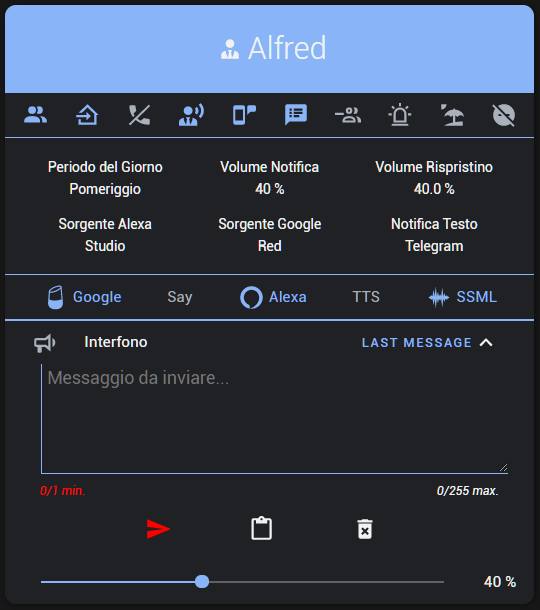
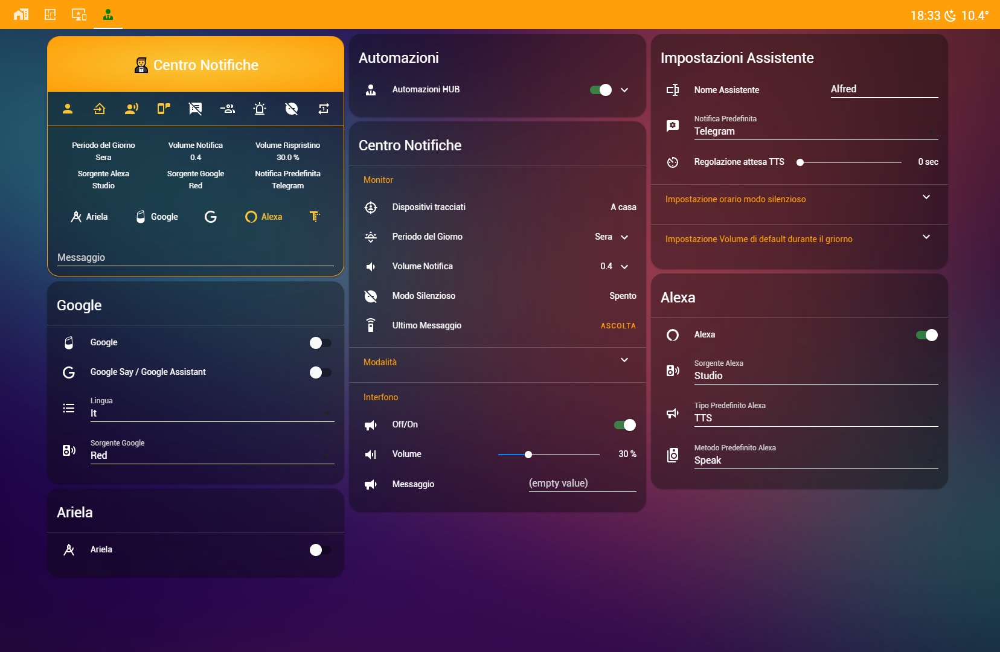
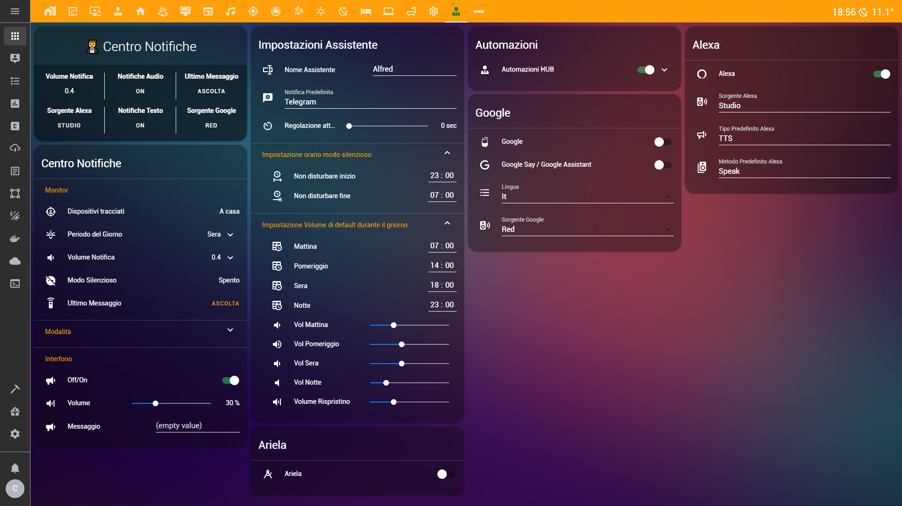
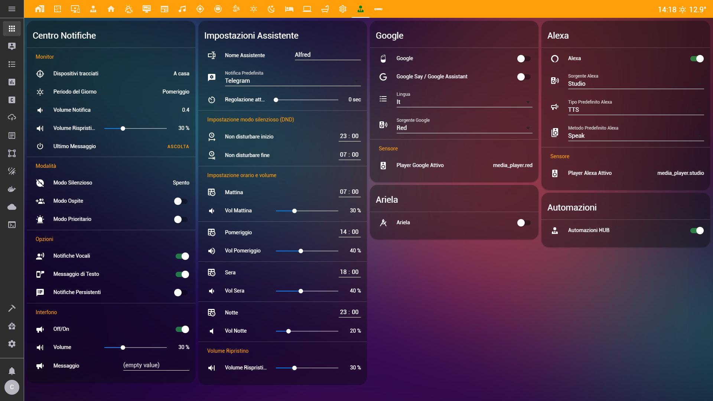

# Package-Notification-HUB-AppDaemon

[](https://github.com/caiosweet/Package-Notification-HUB-AppDaemon/releases)

[![Hass.io][img-hassio]][link-hassio]
[](https://github.com/caiosweet/Package-Notification-HUB-AppDaemon/graphs/commit-activity)
[](https://github.com/caiosweet/Package-Notification-HUB-AppDaemon/issues)

Notifier Centre for Home Assistant [jumping2000](https://github.com/jumping2000/appdaemon/commits?author=jumping2000)<br>
[](https://github.com/jumping2000/notifier/releases)
[](https://github.com/jumping2000/notifier/releases)
[![Hass.io][img-hassio]][link-hassio]
[](https://github.com/jumping2000/notifier/issues)

## Guides and info
[AppDaemon: automazioni al massimo](https://hassiohelp.eu/2019/12/23/appdaemon-automazioni-al-massimo/)

[Nuovo Centro notifiche](https://hassiohelp.eu/2019/12/25/notifer/)


[](https://t.me/HassioHelp)
[](https://www.facebook.com/groups/2062381507393179/)
[](https://forum.hassiohelp.eu/showthread.php?tid=481&pid=1758#pid1758)

## Requirements

  - [AppDaemon](https://appdaemon.readthedocs.io/en/latest/index.html) - [Hassio-Addons](https://github.com/hassio-addons/repository)
  - [Sensor Workday](https://www.home-assistant.io/integrations/workday/)
  - [Sensor DateTime](https://www.home-assistant.io/integrations/time_date/)
  
## Extra
  - [Lovelace Card Mod](https://github.com/thomasloven/lovelace-card-mod)
  - [Lovelace Fold Entity Row](https://github.com/thomasloven/lovelace-fold-entity-row)
  - [Button Entity Row](https://github.com/custom-cards/button-entity-row)
  - [Banner Card](https://github.com/nervetattoo/banner-card)


## [My Lovelace Card](./extra/personal_card.yaml)
<p align="center">

<br><br>
</p>

## [My Lovelace view](./extra/my_lovelace_view.yaml)
<p align="center">

<br><br>
Custom Cards: card-mod, button-entity-row, fold-entity-row
</p>

## [Ex. Banner Card](./extra/card_custom_banner_card.yaml)
<p align="center">

<br><br>
Custom Cards: card-mod, banner-card, fold-entity-row
</p>

## [Standard Lovelace Cards](./lovelace/)
<p align="center">

<br><br>
</p>

To know all the entities, use this jinja code in dev-tools models
```


- {{ state.entity_id -}}

 
```
Ex. Entity in hub_main.yaml file
```


- {{ state.entity_id -}}

 
```
Alexa
```


- {{ state.entity_id -}}

 
```
Create a Card
```
type: entities
title: Alexa
entities:


  - entity: {{ state.entity_id -}}


```

[ interrogare alexa vocalmente su micro argomenti (alexa controlla le finestre, alexa controlla i riscaldamenti, etc...)](https://forum.hassiohelp.eu/showthread.php?tid=276&pid=1681#pid1681)

[img-hassio]:https://img.shields.io/badge/config_for-Hass.io-53c1f1.svg?logo=data:image/svg+xml;base64,PD94bWwgdmVyc2lvbj0iMS4wIiBlbmNvZGluZz0iVVRGLTgiPz48IURPQ1RZUEUgc3ZnIFBVQkxJQyAiLS8vVzNDLy9EVEQgU1ZHIDEuMS8vRU4iICJodHRwOi8vd3d3LnczLm9yZy9HcmFwaGljcy9TVkcvMS4xL0RURC9zdmcxMS5kdGQiPjxzdmcgeG1sbnM9Imh0dHA6Ly93d3cudzMub3JnLzIwMDAvc3ZnIiB4bWxuczp4bGluaz0iaHR0cDovL3d3dy53My5vcmcvMTk5OS94bGluayIgdmVyc2lvbj0iMS4xIiB3aWR0aD0iMjQiIGhlaWdodD0iMjQiIHZpZXdCb3g9IjAgMCAyNCAyNCI+PHBhdGggZD0iTTEyLDE1LjVBMy41LDMuNSAwIDAsMSA4LjUsMTJBMy41LDMuNSAwIDAsMSAxMiw4LjVBMy41LDMuNSAwIDAsMSAxNS41LDEyQTMuNSwzLjUgMCAwLDEgMTIsMTUuNU0xOS40MywxMi45N0MxOS40NywxMi42NSAxOS41LDEyLjMzIDE5LjUsMTJDMTkuNSwxMS42NyAxOS40NywxMS4zNCAxOS40MywxMUwyMS41NCw5LjM3QzIxLjczLDkuMjIgMjEuNzgsOC45NSAyMS42Niw4LjczTDE5LjY2LDUuMjdDMTkuNTQsNS4wNSAxOS4yNyw0Ljk2IDE5LjA1LDUuMDVMMTYuNTYsNi4wNUMxNi4wNCw1LjY2IDE1LjUsNS4zMiAxNC44Nyw1LjA3TDE0LjUsMi40MkMxNC40NiwyLjE4IDE0LjI1LDIgMTQsMkgxMEM5Ljc1LDIgOS41NCwyLjE4IDkuNSwyLjQyTDkuMTMsNS4wN0M4LjUsNS4zMiA3Ljk2LDUuNjYgNy40NCw2LjA1TDQuOTUsNS4wNUM0LjczLDQuOTYgNC40Niw1LjA1IDQuMzQsNS4yN0wyLjM0LDguNzNDMi4yMSw4Ljk1IDIuMjcsOS4yMiAyLjQ2LDkuMzdMNC41NywxMUM0LjUzLDExLjM0IDQuNSwxMS42NyA0LjUsMTJDNC41LDEyLjMzIDQuNTMsMTIuNjUgNC41NywxMi45N0wyLjQ2LDE0LjYzQzIuMjcsMTQuNzggMi4yMSwxNS4wNSAyLjM0LDE1LjI3TDQuMzQsMTguNzNDNC40NiwxOC45NSA0LjczLDE5LjAzIDQuOTUsMTguOTVMNy40NCwxNy45NEM3Ljk2LDE4LjM0IDguNSwxOC42OCA5LjEzLDE4LjkzTDkuNSwyMS41OEM5LjU0LDIxLjgyIDkuNzUsMjIgMTAsMjJIMTRDMTQuMjUsMjIgMTQuNDYsMjEuODIgMTQuNSwyMS41OEwxNC44NywxOC45M0MxNS41LDE4LjY3IDE2LjA0LDE4LjM0IDE2LjU2LDE3Ljk0TDE5LjA1LDE4Ljk1QzE5LjI3LDE5LjAzIDE5LjU0LDE4Ljk1IDE5LjY2LDE4LjczTDIxLjY2LDE1LjI3QzIxLjc4LDE1LjA1IDIxLjczLDE0Ljc4IDIxLjU0LDE0LjYzTDE5LjQzLDEyLjk3WiIgZmlsbD0iI2ZmZmZmZiIgLz48L3N2Zz4K&maxAge=86400

[link-hassio]:https://home-assistant.io/hassio/
