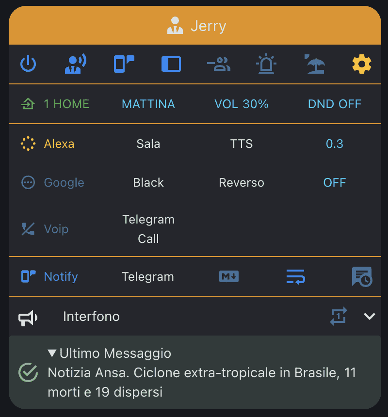
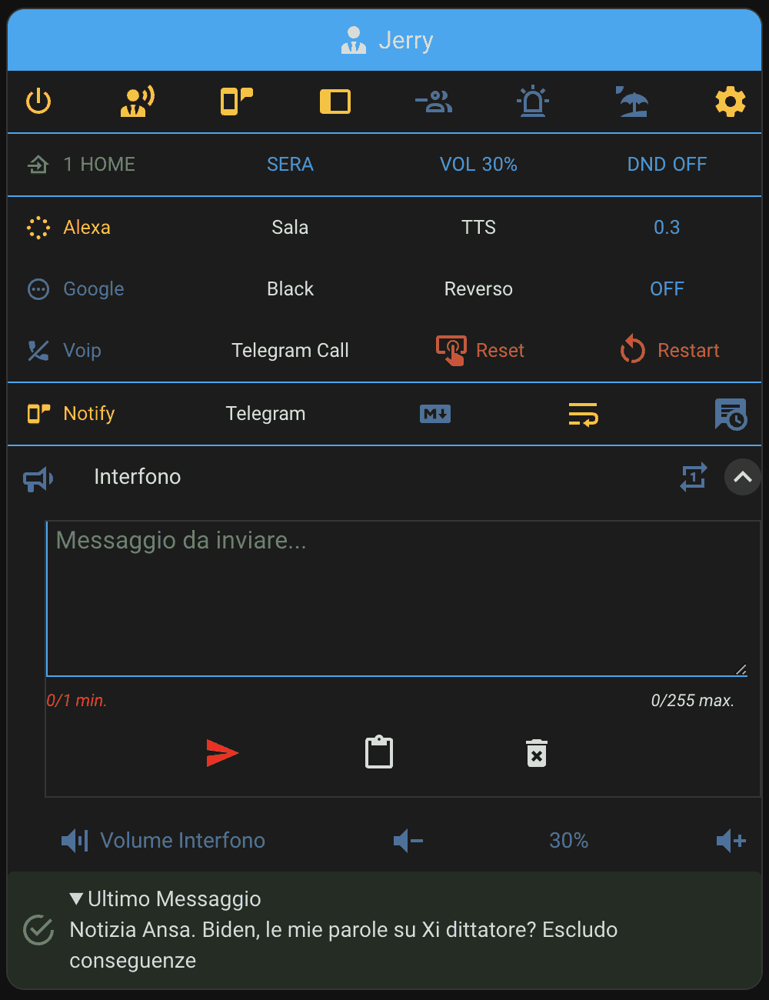
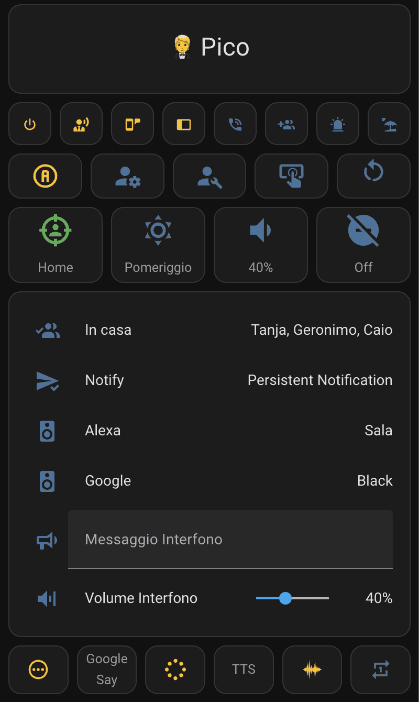
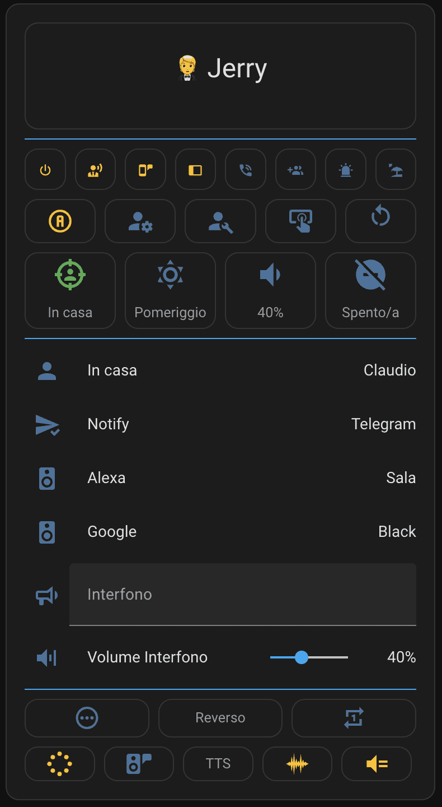
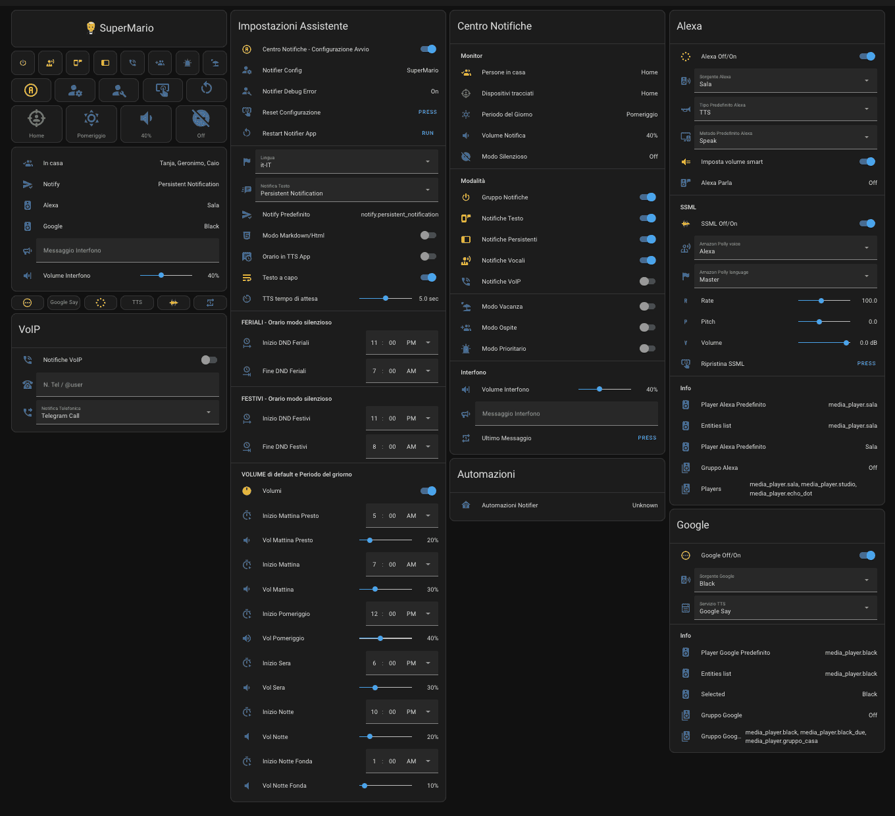

# Package Notification HUB AppDaemon

> **Warning**
> This is a package for Home Assistant, which works together with the [Notifier][notifier] App in [AppDaemon][appdaemon].

> **Note**
> This project is used to send, in one place, text messages (Telegram, Push...), TTS Google and Alexa, Voip notifications to you and/or your devices such as Pcs, smartphones, pads, etc.

⭐ Star us on GitHub — it motivates us a lot!

Package Notification HUB AppDaemon 

[![Hass.io][img-homeassistant]][link-homeassistant]

Appdaemon Notifier for Home Assistant by [Engineer Gianpi (@jumping2000)](https://github.com/jumping2000/appdaemon/commits?author=jumping2000) 

[![Hass.io][img-homeassistant]][link-homeassistant]

How to reach us: 

## [Getting Started][Wiki]

To get started 📚 Read the **[Wiki page][Wiki]**.

[![][blueprint_import_shield]][blueprint_notifier_startup_configuration]

___

## Dashboard preview

### [Card My Menu Custom](./lovelace/card_my_menu_custom.yaml)

  

### My custom menu, contains all in one, but use these custom cards:

[Hass Browser mod](https://github.com/thomasloven/hass-browser_mod),
[Lovelace card mod](https://github.com/thomasloven/lovelace-card-mod),
[Lovelace fold entity row](https://github.com/thomasloven/lovelace-fold-entity-row),

[Lovelace multiline text input card](https://github.com/faeibson/lovelace-multiline-text-input-card),
[Lovelace paper buttons row](https://github.com/jcwillox/lovelace-paper-buttons-row),
[Vertical stack in card](https://github.com/ofekashery/vertical-stack-in-card)

&nbsp;

### [Standard Card Menu](./lovelace/card_menu.yaml)

  

&nbsp;

### [Standard Card Menu HUI](./lovelace/card_menu_hui.yaml)

  

&nbsp;

### [Standard Dashboard](./lovelace/dashboard_raw.yaml)

  

&nbsp;

## If you've found this useful and want to support our work:

# License

MIT License

Copyright (c) 2019-2023 Caio Sweet

Permission is hereby granted, free of charge, to any person obtaining a copy
of this software and associated documentation files (the "Software"), to deal
in the Software without restriction, including without limitation the rights
to use, copy, modify, merge, publish, distribute, sublicense, and/or sell
copies of the Software, and to permit persons to whom the Software is
furnished to do so, subject to the following conditions:

The above copyright notice and this permission notice shall be included in all
copies or substantial portions of the Software.

THE SOFTWARE IS PROVIDED "AS IS", WITHOUT WARRANTY OF ANY KIND, EXPRESS OR
IMPLIED, INCLUDING BUT NOT LIMITED TO THE WARRANTIES OF MERCHANTABILITY,
FITNESS FOR A PARTICULAR PURPOSE AND NONINFRINGEMENT. IN NO EVENT SHALL THE
AUTHORS OR COPYRIGHT HOLDERS BE LIABLE FOR ANY CLAIM, DAMAGES OR OTHER
LIABILITY, WHETHER IN AN ACTION OF CONTRACT, TORT OR OTHERWISE, ARISING FROM,
OUT OF OR IN CONNECTION WITH THE SOFTWARE OR THE USE OR OTHER DEALINGS IN THE
SOFTWARE.

___

$$\textbf{\color{#0099ff} \huge Enjoy Yourself \unicode{x1f973} Caio Sweet}$$

  

<!-- Reference -->

[notifier]: https://github.com/jumping2000/notifier
[appdaemon]: https://appdaemon.readthedocs.io/en/stable/index.html
[addon-ad]: https://github.com/hassio-addons/repository

[img-homeassistant]:https://img.shields.io/badge/config_for-homeassistant.io-53c1f1.svg?logo=data:image/svg+xml;base64,PD94bWwgdmVyc2lvbj0iMS4wIiBlbmNvZGluZz0iVVRGLTgiPz48IURPQ1RZUEUgc3ZnIFBVQkxJQyAiLS8vVzNDLy9EVEQgU1ZHIDEuMS8vRU4iICJodHRwOi8vd3d3LnczLm9yZy9HcmFwaGljcy9TVkcvMS4xL0RURC9zdmcxMS5kdGQiPjxzdmcgeG1sbnM9Imh0dHA6Ly93d3cudzMub3JnLzIwMDAvc3ZnIiB4bWxuczp4bGluaz0iaHR0cDovL3d3dy53My5vcmcvMTk5OS94bGluayIgdmVyc2lvbj0iMS4xIiB3aWR0aD0iMjQiIGhlaWdodD0iMjQiIHZpZXdCb3g9IjAgMCAyNCAyNCI+PHBhdGggZD0iTTEyLDE1LjVBMy41LDMuNSAwIDAsMSA4LjUsMTJBMy41LDMuNSAwIDAsMSAxMiw4LjVBMy41LDMuNSAwIDAsMSAxNS41LDEyQTMuNSwzLjUgMCAwLDEgMTIsMTUuNU0xOS40MywxMi45N0MxOS40NywxMi42NSAxOS41LDEyLjMzIDE5LjUsMTJDMTkuNSwxMS42NyAxOS40NywxMS4zNCAxOS40MywxMUwyMS41NCw5LjM3QzIxLjczLDkuMjIgMjEuNzgsOC45NSAyMS42Niw4LjczTDE5LjY2LDUuMjdDMTkuNTQsNS4wNSAxOS4yNyw0Ljk2IDE5LjA1LDUuMDVMMTYuNTYsNi4wNUMxNi4wNCw1LjY2IDE1LjUsNS4zMiAxNC44Nyw1LjA3TDE0LjUsMi40MkMxNC40NiwyLjE4IDE0LjI1LDIgMTQsMkgxMEM5Ljc1LDIgOS41NCwyLjE4IDkuNSwyLjQyTDkuMTMsNS4wN0M4LjUsNS4zMiA3Ljk2LDUuNjYgNy40NCw2LjA1TDQuOTUsNS4wNUM0LjczLDQuOTYgNC40Niw1LjA1IDQuMzQsNS4yN0wyLjM0LDguNzNDMi4yMSw4Ljk1IDIuMjcsOS4yMiAyLjQ2LDkuMzdMNC41NywxMUM0LjUzLDExLjM0IDQuNSwxMS42NyA0LjUsMTJDNC41LDEyLjMzIDQuNTMsMTIuNjUgNC41NywxMi45N0wyLjQ2LDE0LjYzQzIuMjcsMTQuNzggMi4yMSwxNS4wNSAyLjM0LDE1LjI3TDQuMzQsMTguNzNDNC40NiwxOC45NSA0LjczLDE5LjAzIDQuOTUsMTguOTVMNy40NCwxNy45NEM3Ljk2LDE4LjM0IDguNSwxOC42OCA5LjEzLDE4LjkzTDkuNSwyMS41OEM5LjU0LDIxLjgyIDkuNzUsMjIgMTAsMjJIMTRDMTQuMjUsMjIgMTQuNDYsMjEuODIgMTQuNSwyMS41OEwxNC44NywxOC45M0MxNS41LDE4LjY3IDE2LjA0LDE4LjM0IDE2LjU2LDE3Ljk0TDE5LjA1LDE4Ljk1QzE5LjI3LDE5LjAzIDE5LjU0LDE4Ljk1IDE5LjY2LDE4LjczTDIxLjY2LDE1LjI3QzIxLjc4LDE1LjA1IDIxLjczLDE0Ljc4IDIxLjU0LDE0LjYzTDE5LjQzLDEyLjk3WiIgZmlsbD0iI2ZmZmZmZiIgLz48L3N2Zz4K&maxAge=86400

[link-homeassistant]:https://www.home-assistant.io/getting-started
[Wiki]: https://github.com/caiosweet/Package-Notification-HUB-AppDaemon/wiki
[blueprint_import_shield]: https://my.home-assistant.io/badges/blueprint_import.svg
[blueprint_notifier_startup_configuration]: https://my.home-assistant.io/redirect/blueprint_import/?blueprint_url=https%3A%2F%2Fgithub.com%2Fcaiosweet%2FPackage-Notification-HUB-AppDaemon%2Fblob%2Fmain%2Fblueprints%2Fautomation%2Fcaiosweet%2Fnotifier_startup_configuration.yaml
